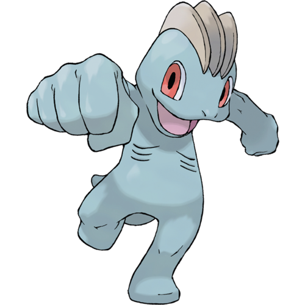

# Machop: the software stack for MASE



[Machop](https://bulbapedia.bulbagarden.net/wiki/Machop_(Pok%C3%A9mon)) is a humanoid, bipedal Pokémon that has blue-gray skin. It has three brown ridges on top of its head, large red eyes, and a relatively flat face. On either side of its chest are three, thin, rib-like stripes. Its feet appear to have no toes, while its hands have five fingers. Machop also has a short, stubby tail.

Why called Machop? Because Machop is the most common pokemon you can find in the [Final Maze](https://bulbapedia.bulbagarden.net/wiki/Final_Maze)!

For more, you can watch this [video](https://www.youtube.com/watch?v=JEUsN_KlDy8&ab_channel=Mah-Dry-Bread-Gameplay%26Streams%21).


## Commands

### Example CPU run

```bash
./chop --train \
--dataset=cifar10 \
--model=resnet18 \
--save=test
```

### Example debug run

```bash
./chop --train \
--dataset=cifar10 \
--model=resnet18 \
--save=test \
--debug
```

### Example GPU run

```bash
./chop --train \
--dataset=cifar10 \
--model=resnet18 \
--save=test \
--debug \
--accelerator=gpu \
--gpu=4
```

### Example modify run

```bash
./chop \
--dataset=cifar10 \
--model=toy \
--save=test \
--debug \
--modify-sw=configs/test.toml
```

- All modifiable components should be defined in a `toml` file and loaded using `--modify-sw`.
- This example command shows how to apply the command to a toy network.

Mase also supports training with a modified model, for instance:

```bash
# train a normal model
./chop --train --dataset=cifar10 --model=toy --save=test
# Check the accuracy, without modification
./chop --evaluate-sw --dataset=cifar --model=toy --load checkpoints/test/best.ckpt
# Check the accuracy of modification, without re-training, this is a classic post-training quantization scenario
./chop --evaluate-sw --dataset=cifar --model=toy --load checkpoints/test/best.ckpt --modify-sw=configs/test.toml

# take the trained model, modify it and continue to train, this is known as quantization aware training
./chop --train --dataset=cifar --model=toy --save modified_test --load checkpoints/test/best.ckpt --modify-sw=configs/test.toml
# check again the re-trained accuracy
./chop --evaluate-sw --dataset=cifar --model=toy --load checkpoints/modified_test/best.ckpt --modify-sw=configs/test.toml

# enter modify again to check weights, etc.; you do not necessarily have to save the model in modify
./chop --dataset=cifar --model=toy --load checkpoints/modified_test/best.ckpt --modify-sw configs/test.toml
```

### Training log check

```bash
tensorboard --logdir your-log-directory
```

## Quick coding style guide

- For Python: `docs/python.md`

## Tested commands and functionalities

- Train from modified toynet with fixed-point quantization
  ```bash
  ./chop --train --dataset=cifar10 --model=toy --modify-sw configs/tests/integer.toml --save test
  # chop --train --dataset=cifar10 --model=toy --modify-sw configs/tests/integer.toml --save test --training-optimizer sgd --seed 666 --learning_rate 1e-4 --max-epochs 2 --batch-size 128
  ```

- Train from custom toynet that has mixed-precision fixed-point quantization
  ```bash
  ./chop --train --dataset=cifar10 --model=toy_manual --modify-sw configs/toy_manual.toml --save test
  ```
